# 2_image_warping

## 2.1 IDW 算法

根据文档中的原理，在变换中我们需要计算的是矩阵 $T$，它们是线性方程组 $T A = B$ 的解。

而文档中也给出了 $A, B$ 的计算方法，只需据此写出代码即可，同时由于存在一个求逆操作，因此我添加了一个正则项以避免求逆失败。

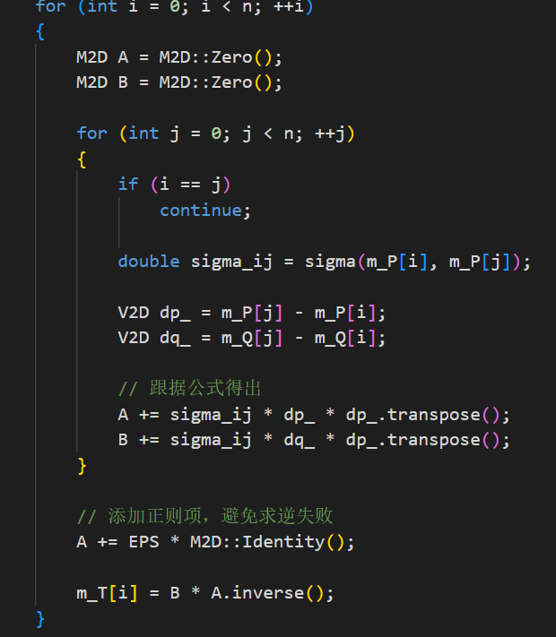

这里我自定义了几个常用类型名的简写，在 type_define.h

在进行 warp 时，我们需要计算给定点的若干权重，并进行一个加权求和

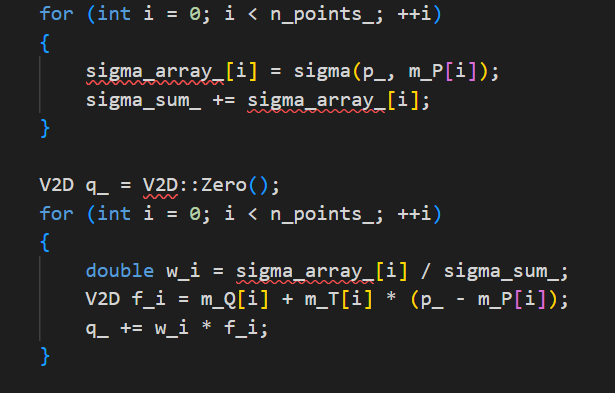

## 2.2 RBF 算法

RBF 算法是一个线性变换 + 一个 R 函数的形式，我们在变换中需要计算的有线性变换的 $A, b$，以及 R 函数的参数 $\alpha$。

这里我是用最小二乘方法实现的计算，即有 

$$
P * C = Q, C = (A, b)^T
$$

使用 Eigen 自带的最小二乘方法 colPivHouseholderQr 即可求解

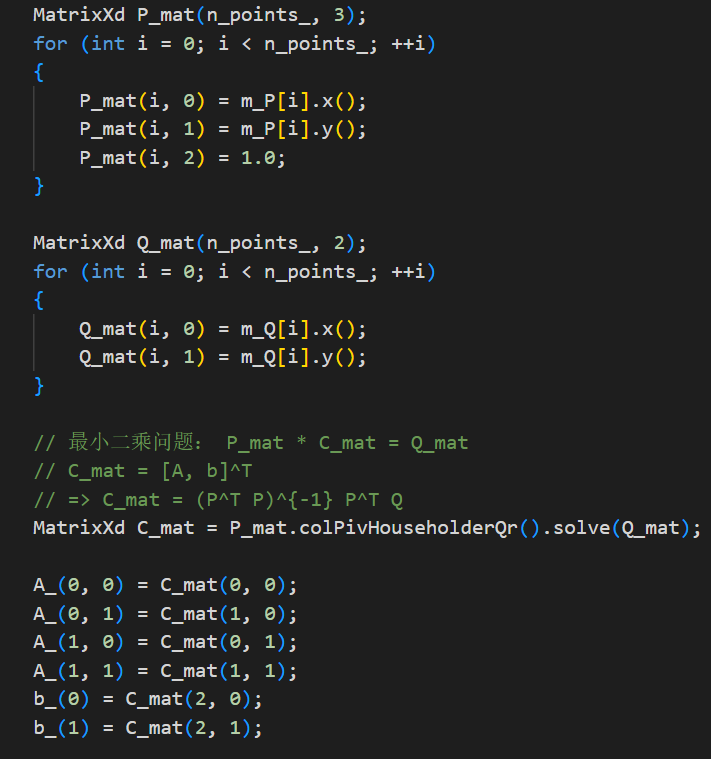

得到 $A, b$ 之后，求 $\alpha$ 就比较简单了，因为有等式

$$
R_i = Q_i - (A * P_i + b) = \sum_{j=1}^{n} \alpha_j * g(||P_i - P_j||) \br

=> G * \alpha = R
$$

其中 $G(i, j) = g(||P_i - P_j||)$，$R(i) = Q_i - (A * P_i + b)$，同样是一个线性方程组，同样使用 Eigen 自带的最小二乘方法 colPivHouseholderQr 求解

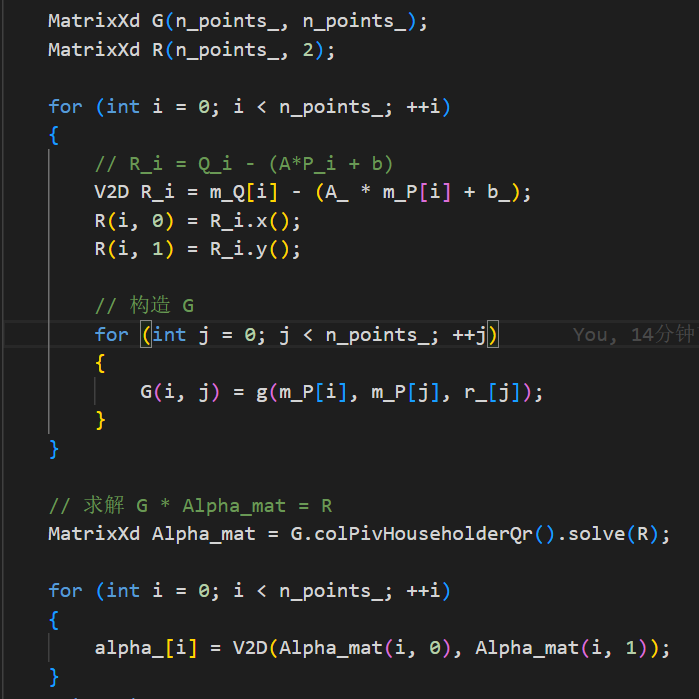

## 2.3 特殊情况

在实现 RBF 的时候发现文档中考虑到用户有可能只给定 1 或 2 组控制点的情况，因此在 IDW 中补充了相应判断：

1. 1组控制点：显然是一个平移操作
2. 2组控制点：则是一个仿射变换，它包含旋转、缩放、平移三个操作，分别计算对应的参数即可

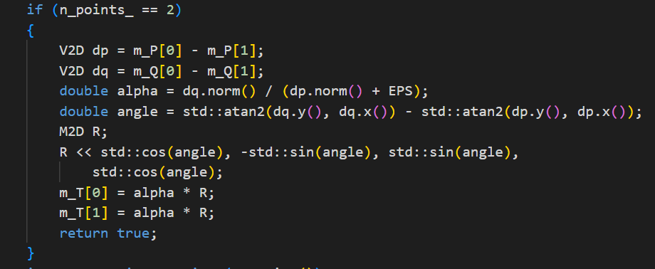

## 2.4 补洞

出现空洞的原理就是由于变换后的点是连续的，而我们会将它们映射成离散点来设置像素颜色，因此这个映射并非一一映射，几乎必然存在空洞。

我一开始想的是确认一下变换后的边界与图像大小的交集作为补洞范围，然后查找没有被赋值的点，用插值来补一下。但是后来觉得这样比较难做，主要是因为这个边界很难计算。

后来想尝试逆变换，但是也比较难想。后来想到 Warper 求的是从源点到目标点的变换，而逆变换是从目标点到源点的变换。于是我直接交换了 Warper 的输入，然后遍历所有像素，找原图中的映射，如果映射存在，就直接填上，尽管可以用插值使得效果更好，但我觉得直接填上就差不多够用了。效果见 2.5 测试结果。

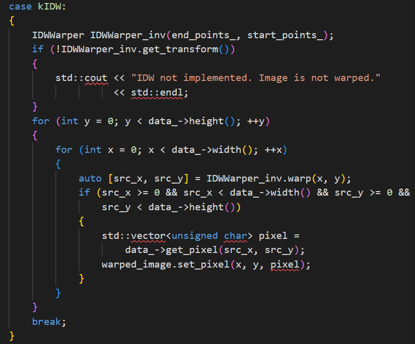

## 2.5 测试结果

### 2.3.1 IDW

*$mu = 2$*

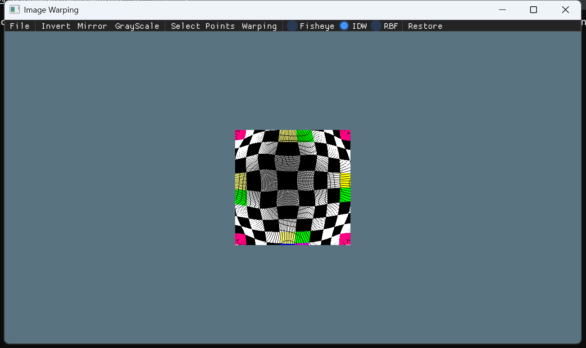

*$mu = 3$*

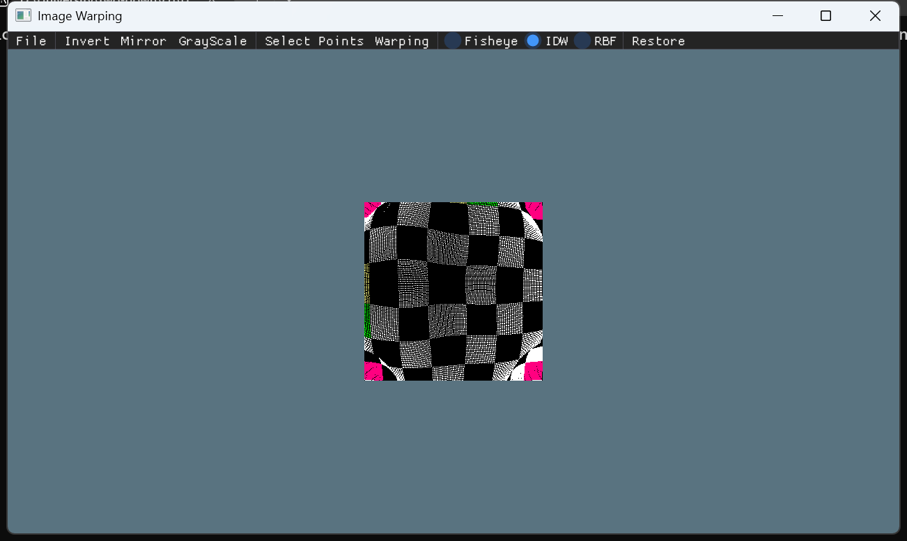

*$mu = 1e12$*

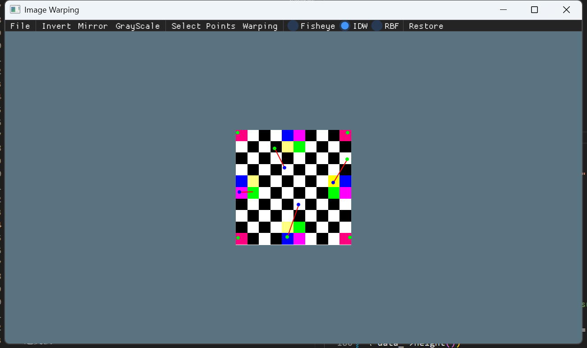

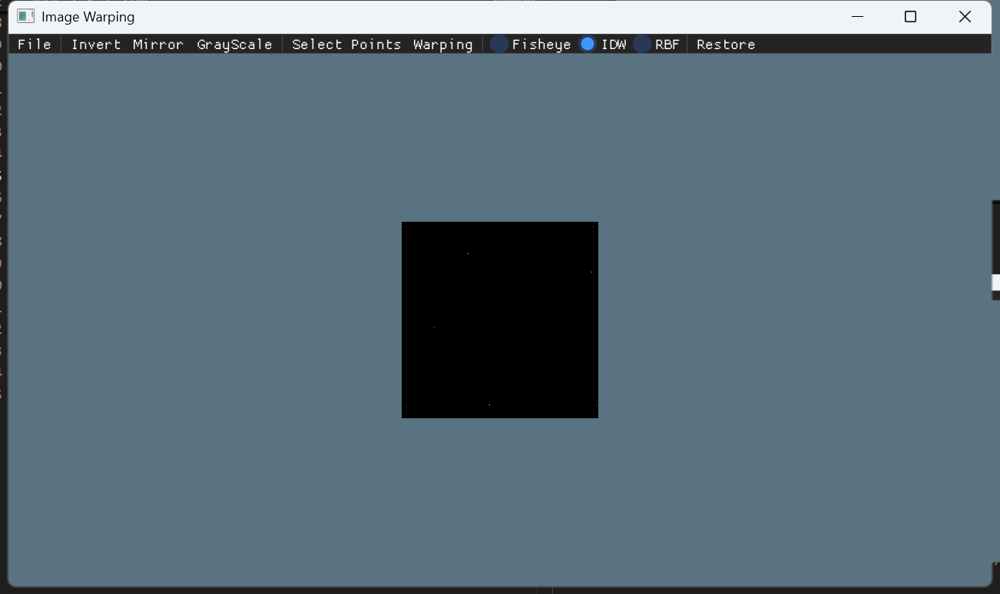

似乎 $\mu$ 越大，离控制点距离大小的影响越大，当 $\mu = 1e12$ 时，几乎可以看作是最近邻插值。

*逆变换*

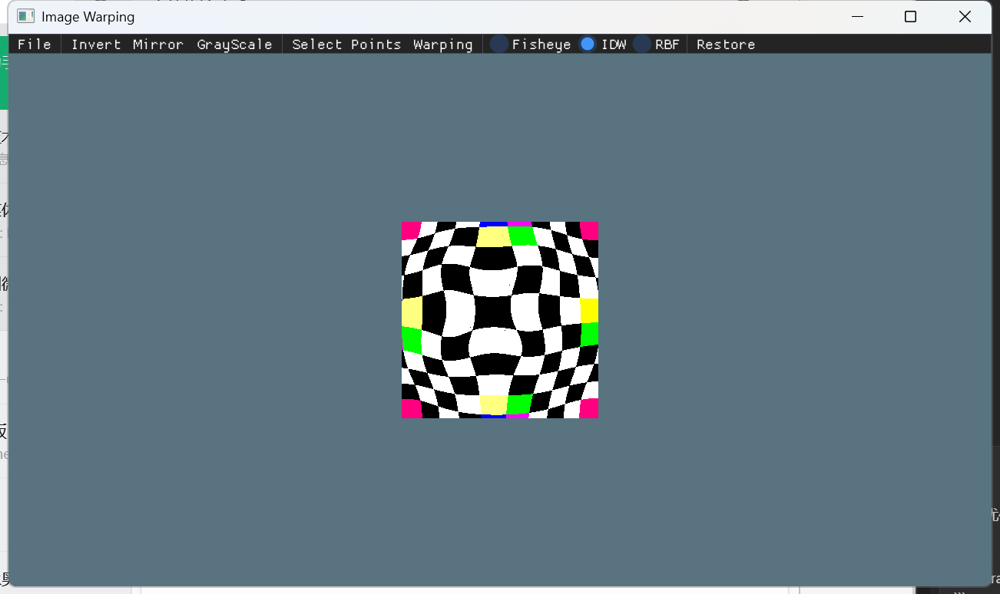

### 2.3.2 RBF

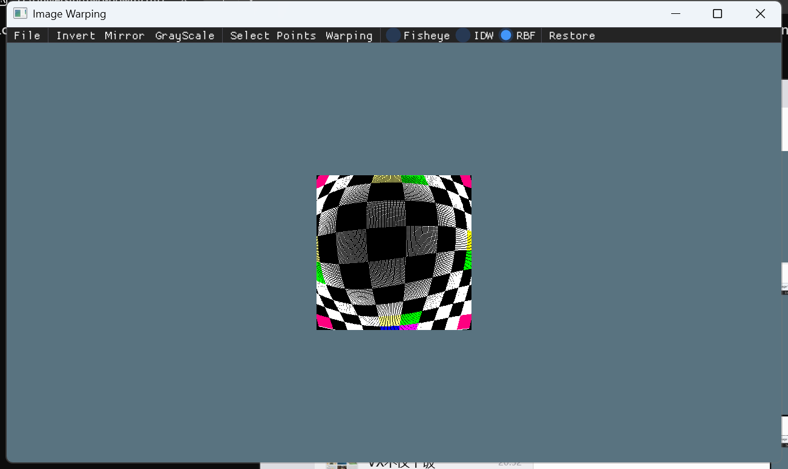

*逆变换*

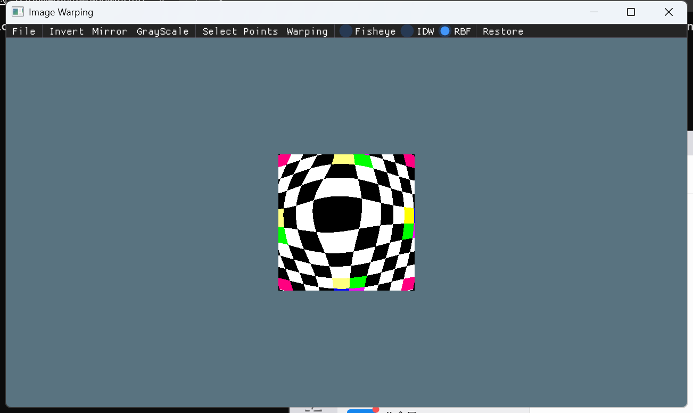

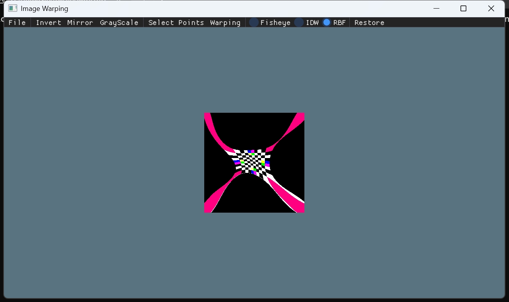

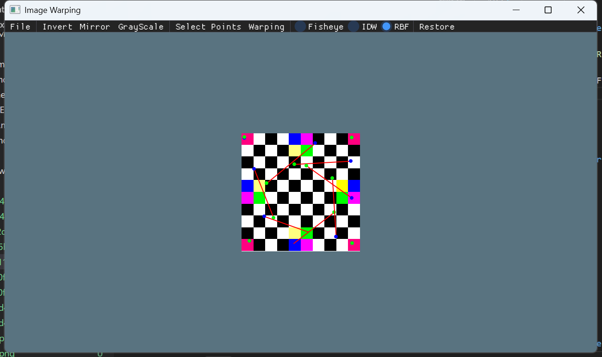

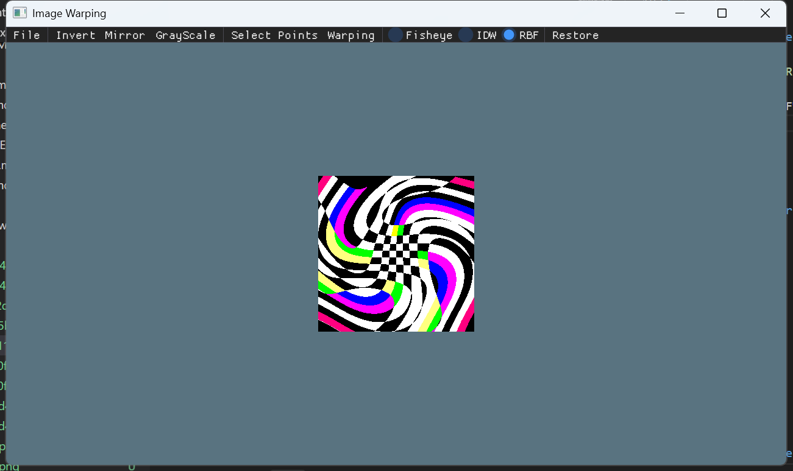